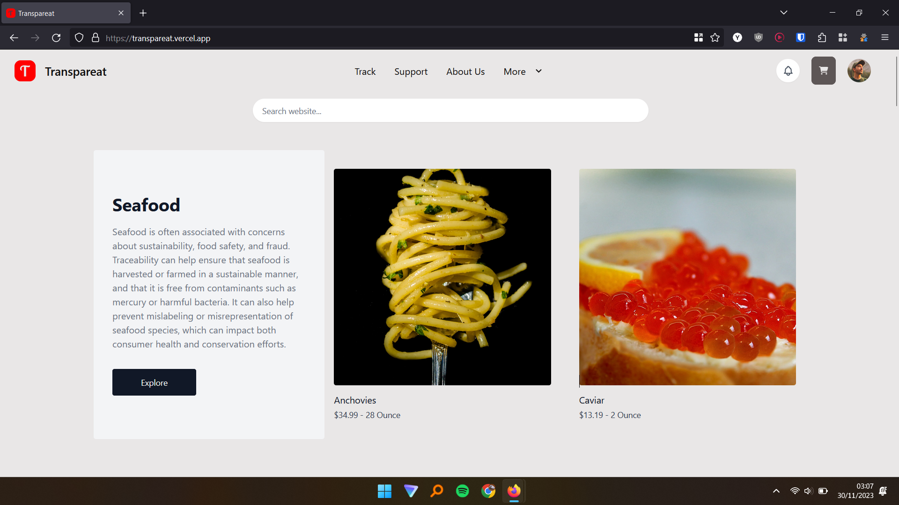
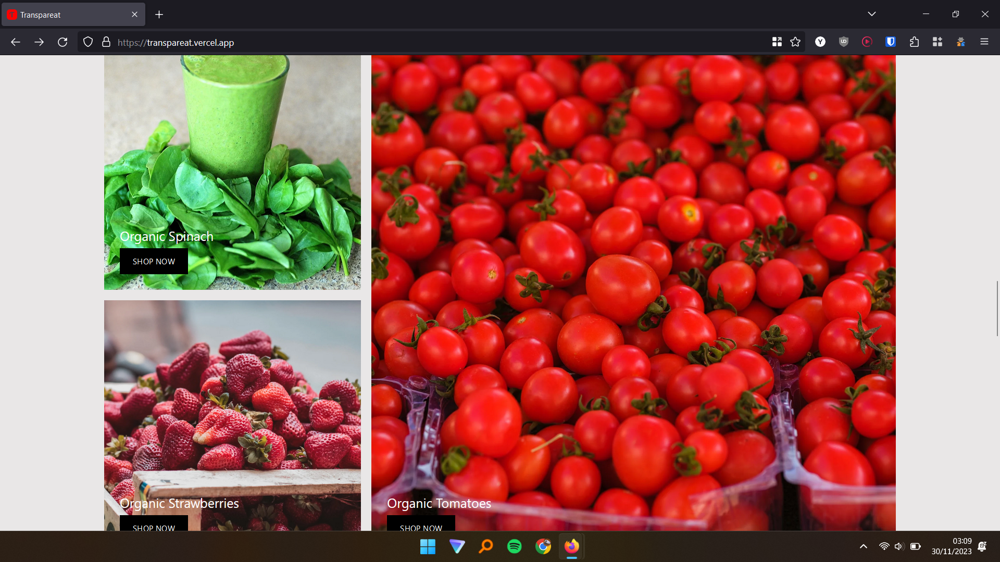
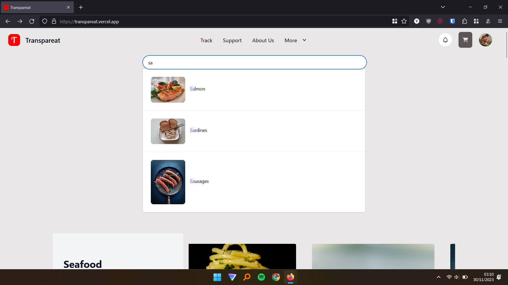
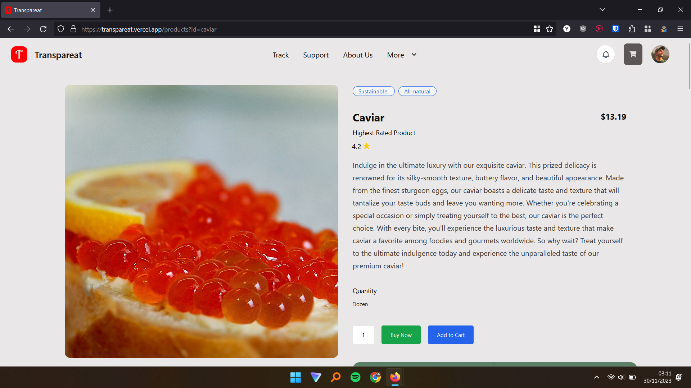
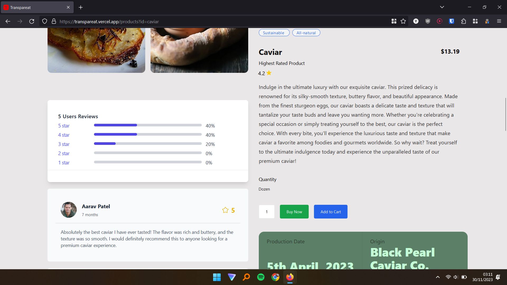
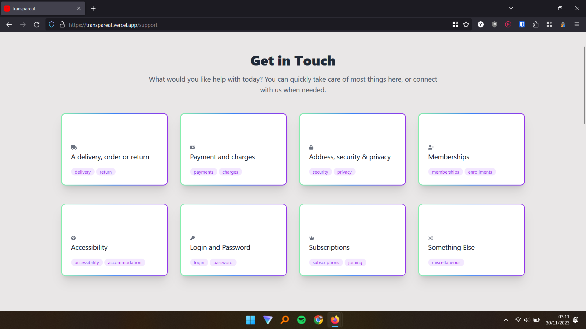
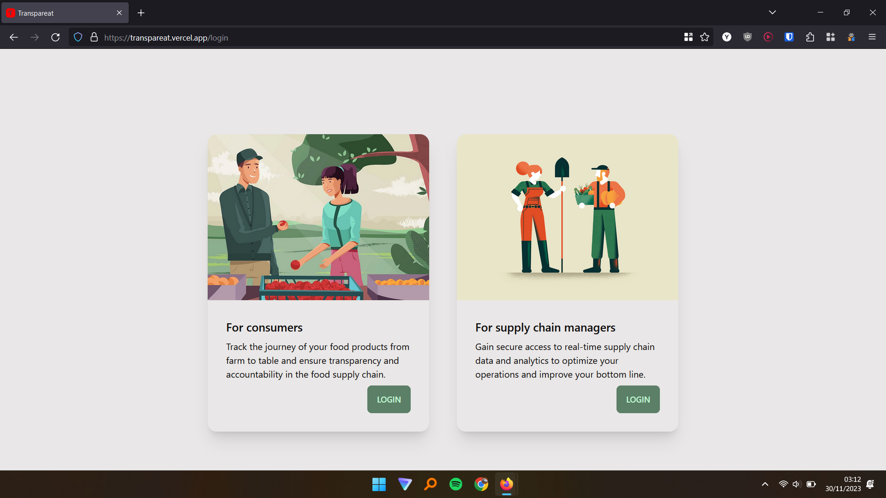
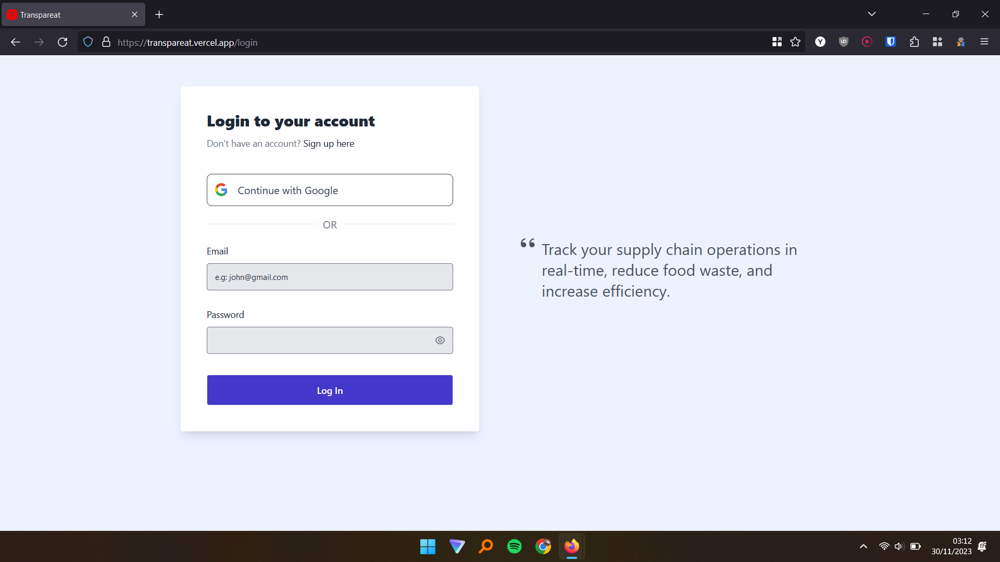

# Transpareat

A platform that enables end-to-end traceability of food products, from farm to table, improving transparency and accountability in the food supply
chain.

## Live Demo

[Transpareat](https://transpareat.vercel.app/)

## Motivation

The lack of transparency in the food supply chain poses a significant threat to public health, with nearly one in ten people falling ill annually due to contaminated food, resulting in approximately 420,000 deaths. The absence of accessible information about the farm, production processes, and the individuals responsible for food production contributes to these health risks. In instances of contamination or quality issues, the inability to trace the source impedes accountability and erodes trust in the food industry. Transpareat aims to address this critical issue by providing users with comprehensive details about their food, enabling them to make informed choices, and fostering accountability throughout the entire food supply chain.

## Tech Stack

Here's a brief high-level overview of the tech stack the app uses:

- Frontend Framework - Vue.js
- CSS Framework - Tailwind CSS
- Backend and Database - Firebase

## Features

- Browse an extensive list of food products spanning various categories
- Seamlessly make secure payments within the app
- Provides tailored food recommendations based on the currently viewed item and individual purchase history
- Utilize a robust search feature powered by Algolia to easily locate specific food items or explore new options within the comprehensive catalog
- Access interactive maps that visually depict the transportation routes of the food products
- Engage with the community by contributing personal comments, reviews, and ratings on food items

## Project Setup

```sh
npm install
```

### Compile and Hot-Reload for Development

```sh
npm run dev
```

### Compile and Minify for Production

```sh
npm run build
```

## Screenshots










## Contributions

Please feel free to help out with this project! If you see something that could be made better or want a new feature, open up an issue or send a pull request!

## License

Licensed under the [MIT](LICENSE.txt) license.
